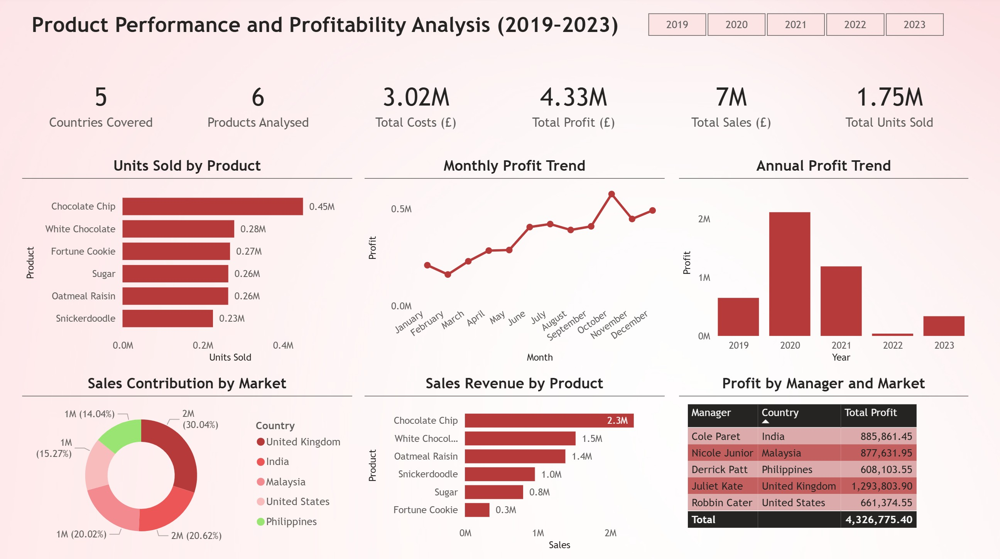

# Product Performance and Profitability Analysis (2019–2023)

This Power BI dashboard analyses product-level performance and profitability across multiple markets between 2019 and 2023. The report is designed to provide clear commercial insights into sales volumes, revenue contribution, and profit trends by product, market, and management responsibility.

## Key Insights
- Chocolate Chip is the top-performing product in both units sold and revenue generated.
- Profitability peaked in 2020, followed by a decline in 2022 and partial recovery in 2023.
- The United Kingdom and India contribute the largest share of total sales revenue.
- Clear differences exist between high-volume products and high-margin contributors.

## Dashboard Overview
The report includes:
- KPI summary cards (sales, profit, costs, units sold)
- Units Sold by Product
- Monthly Profit Trend
- Profit by Year
- Sales Contribution by Market
- Sales Revenue by Product
- Profit by Manager and Market

## Tools and Techniques
- Power BI Desktop
- DAX measures for KPIs and aggregations
- Excel for raw data preparation
- Business-focused visual design and layout

## Files in This Repository
- `Product-Performance-Profitability.pbix` – Power BI report file  
- `Product-Performance-Profitability.pdf` – Static export of the dashboard  
- `Product-Performance-Profitability.jpg` – Dashboard preview image  
- `Product-Performance-Profitability-Raw-Data.xlsx` – Source dataset  

## Preview

## Author
**Nelma Cavaleiro**  
Data Analytics & Project Management  
GitHub: https://github.com/nelmacavaleiro  
LinkedIn: https://www.linkedin.com/in/nelmacavaleiro/
